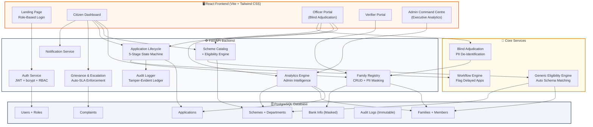
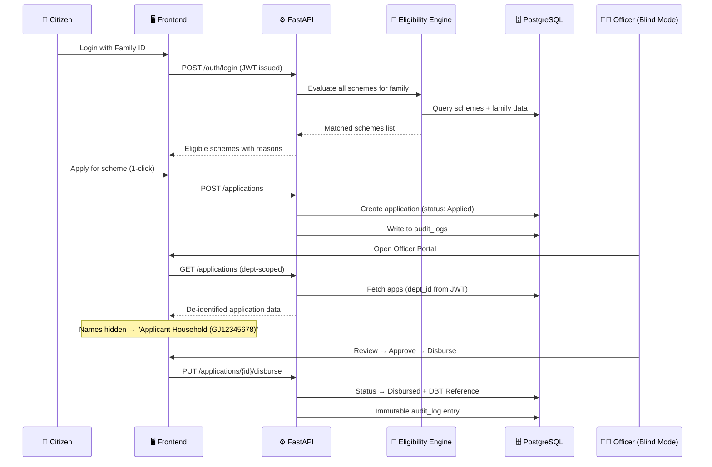

<p align="center">
  
  
  
  
  
</p>

# ParivarSetu (પરિવાર સેતુ)

### One Family – One ID: Unified Scheme Benefit Tracking & Direct Benefit Transfer Platform

**Government of Gujarat (ગુજરાત સરકાર) | General Administration Department**

---

ParivarSetu is a full-stack e-governance platform built for the **Government of Gujarat** under the **"One Family – One ID (GJ-XXXXXXXX)"** paradigm. It eliminates welfare benefit leakage, automates cross-department eligibility matching, enforces bias-free adjudication, and provides transparent, auditable Direct Benefit Transfer (DBT) disbursals — all through a single, unified Family ID.

> **Key Innovation:** ParivarSetu introduces **Blind Adjudication**, a **Generic Eligibility Engine** that auto-matches families to schemes across any department without manual paperwork, and **Executive Intelligence Analytics** for state administrators — features that go beyond traditional benefit management systems.

---

## 🗄️ Database Schema, Indexes & Constraints

ParivarSetu uses **PostgreSQL 18** with carefully designed indexes, unique constraints, and ARRAY columns with GIN indexing for fast eligibility matching.

### Entity-Relationship Diagram

```mermaid
erDiagram
    USERS ||--o{ AUDIT_LOGS : "creates"
    USERS }o--|| DEPARTMENTS : "belongs_to"
    USERS }o--|| FAMILIES : "linked_to"
    DEPARTMENTS ||--o{ SCHEMES : "owns"
    FAMILIES ||--o{ FAMILY_MEMBERS : "has"
    FAMILIES ||--|| BANK_INFO : "has"
    FAMILIES ||--o{ HEALTH_INFO : "has"
    FAMILIES ||--o{ EDUCATION_INFO : "has"
    FAMILIES ||--o{ BUSINESS_INFO : "has"
    FAMILIES ||--o{ APPLICATIONS : "files"
    FAMILIES ||--o{ NOTIFICATIONS : "receives"
    SCHEMES ||--o{ APPLICATIONS : "receives"
    SCHEMES ||--o{ NOTIFICATIONS : "generates"
    APPLICATIONS ||--o{ COMPLAINTS : "has"
    FAMILY_MEMBERS ||--o{ HEALTH_INFO : "has"
    FAMILY_MEMBERS ||--o{ EDUCATION_INFO : "has"
    FAMILY_MEMBERS ||--o{ BUSINESS_INFO : "has"

    FAMILIES {
        string family_id PK "GJ-XXXXXXXX"
        string head_name "NOT NULL"
        numeric income "NOT NULL, 12-2 precision"
        string category "BPL/SC/ST/OBC/General"
        string district "Gandhinagar, Ahmedabad..."
        string ration_card_no UK "UNIQUE constraint"
        string aadhaar_ref_masked "XXXX-XXXX-1234"
        string status "provisional/permanent/rejected"
        string_array health_tags "GIN indexed — cardiac, diabetes..."
        string_array education_tags "GIN indexed"
        string_array business_tags "GIN indexed"
        datetime created_at "auto"
        datetime updated_at "auto on update"
    }

    FAMILY_MEMBERS {
        int id PK "auto-increment"
        string family_id FK "CASCADE on delete"
        string name "member name"
        int age "age"
        string gender "M/F"
        string relation "head/spouse/child/parent"
        string occupation "occupation"
    }

    SCHEMES {
        int id PK "auto-increment"
        int dept_id FK "department reference"
        string name "NOT NULL"
        text description "scheme details"
        numeric min_income "eligibility rule"
        numeric max_income "eligibility rule"
        string category "BPL/SC/ST..."
        string required_condition_tag "health rule — GIN lookup"
        string required_class "education rule"
        float min_percentage "education rule"
        string business_category "MSME rule"
        int min_business_age "months"
        numeric benefit_amount "disbursal amount"
        boolean active "true/false"
    }

    APPLICATIONS {
        int id PK "auto-increment"
        string family_id FK "family reference"
        int member_id FK "nullable"
        int scheme_id FK "scheme reference"
        string status "Applied/Under Review/Approved/Disbursed/Rejected/Escalated"
        numeric disbursed_amount "DBT amount"
        string txn_id "DBT-GJ-XXXXX"
        datetime applied_on "application date"
        datetime updated_at "auto on update"
    }

    USERS {
        int id PK "auto-increment"
        string email UK "UNIQUE, NOT NULL"
        string password_hash "bcrypt hashed"
        string role "citizen/officer/verifier/admin"
        int dept_id FK "nullable — officers only"
        string family_id FK "nullable — citizens only"
    }

    DEPARTMENTS {
        int id PK "auto-increment"
        string name UK "UNIQUE, NOT NULL"
    }

    BANK_INFO {
        int id PK "auto-increment"
        string family_id UK "UNIQUE FK, CASCADE on delete"
        string account_number_masked "****4321"
        string ifsc "SBIN0001234"
        string bank_name "State Bank of India"
        string account_holder "holder name"
    }

    HEALTH_INFO {
        int id PK "auto-increment"
        string family_id FK "CASCADE on delete"
        int member_id FK "CASCADE on delete"
        string_array condition_tags "GIN — pregnant, diabetic, disability"
        boolean bpl_health_card "true/false"
    }

    EDUCATION_INFO {
        int id PK "auto-increment"
        string family_id FK "CASCADE on delete"
        int member_id FK "CASCADE on delete"
        string current_class "12th, Graduate..."
        string school_or_college "institution name"
        float last_percentage "merit percentage"
        string enrollment_status "enrolled/dropped"
    }

    BUSINESS_INFO {
        int id PK "auto-increment"
        string family_id FK "CASCADE on delete"
        int member_id FK "CASCADE on delete"
        string business_name "business name"
        string business_type "startup/MSME/small_business"
        string registration_status "registered/unregistered"
        int business_age_months "age in months"
        numeric annual_turnover "12-2 precision"
    }

    COMPLAINTS {
        int id PK "auto-increment"
        int application_id FK "application reference"
        text message "NOT NULL"
        string status "Open/Resolved"
        text officer_response "resolution remark"
        datetime created_at "auto"
        datetime resolved_at "resolution timestamp"
    }

    NOTIFICATIONS {
        int id PK "auto-increment"
        string family_id FK "family reference"
        int scheme_id FK "scheme reference"
        text message "NOT NULL"
        boolean read "true/false"
        datetime created_at "auto"
    }

    AUDIT_LOGS {
        int id PK "auto-increment"
        int user_id FK "who performed action"
        string action "approve/reject/disburse/verify"
        string entity "application/family/complaint"
        string entity_id "reference ID"
        datetime timestamp "auto — immutable"
    }
```



### Indexes & Constraints for Fast Queries

| Table | Index / Constraint | Type | Purpose |
|---|---|---|---|
| `families` | `family_id` | **Primary Key** | O(1) lookup by Family ID `GJ-XXXXXXXX` |
| `families` | `ration_card_no` | **Unique** | Prevents duplicate ration card registrations |
| `families` | `health_tags` | **PostgreSQL ARRAY + GIN** | O(1) `ANY()` health condition matching for eligibility engine |
| `families` | `education_tags` | **PostgreSQL ARRAY + GIN** | Fast education tag filtering |
| `families` | `business_tags` | **PostgreSQL ARRAY + GIN** | Fast business tag filtering |
| `users` | `email` | **Unique** | Prevents duplicate user accounts, fast login lookup |
| `departments` | `name` | **Unique** | Prevents duplicate departments |
| `applications` | `(family_id, member_id, scheme_id)` | **Unique Composite** | Prevents same family member from applying to the same scheme twice |
| `notifications` | `(family_id, scheme_id)` | **Unique Composite** | Prevents duplicate eligibility notifications per family per scheme |
| `bank_info` | `family_id` | **Unique FK** | One-to-one: each family has exactly one bank account |
| `applications` | `family_id` FK | **Foreign Key** | Fast join from families → applications |
| `applications` | `scheme_id` FK | **Foreign Key** | Fast join from schemes → applications |
| `family_members` | `family_id` FK | **Foreign Key + CASCADE** | Auto-delete members when family is removed |
| `health_info` | `family_id` FK | **Foreign Key + CASCADE** | Auto-delete health records on family removal |
| `education_info` | `family_id` FK | **Foreign Key + CASCADE** | Auto-delete education records on family removal |
| `business_info` | `family_id` FK | **Foreign Key + CASCADE** | Auto-delete business records on family removal |
| `audit_logs` | `user_id` FK | **Foreign Key** | Trace which user performed each action |

### Why GIN Indexes on ARRAY Columns?

The **Generic Eligibility Engine** uses PostgreSQL `ARRAY` columns (`health_tags`, `education_tags`, `business_tags`, `condition_tags`) to store multi-valued attributes. GIN (Generalized Inverted Index) enables:

```sql
-- Without GIN: Full table scan O(n)
-- With GIN: Index lookup O(1)
SELECT * FROM families WHERE health_tags @> ARRAY['cardiac'];
```

This makes scheme-to-family matching **instant** even with 10,000+ families — the engine queries `Family.health_tags.any('cardiac')` which PostgreSQL resolves via GIN in microseconds.

---

## 📐 System Architecture



### Data Flow: Citizen Application Lifecycle



---

## 🔐 Security Architecture

ParivarSetu implements **defense-in-depth** security aligned with Government of India cybersecurity guidelines:

| Layer | Mechanism | Description |
|---|---|---|
| **Authentication** | JWT + bcrypt | Passwords hashed with bcrypt (cost factor 12). Stateless JWT tokens carry `role`, `dept_id`, `family_id` claims |
| **Authorization (RBAC)** | Role-Based Access Control | 4 distinct roles: `citizen`, `officer`, `verifier`, `admin`. Each role has dedicated FastAPI dependency guards (`require_citizen`, `require_officer`, `require_verifier`, `require_roles`) |
| **Department Isolation** | JWT Claim Enforcement | Officers can ONLY access data from their assigned department. `dept_id` is extracted server-side from the JWT token — never from client input. Cross-department access returns `403 Forbidden` |
| **Anti-IDOR Protection** | Server-Side Ownership Checks | Citizens cannot view/modify another family's data, applications, or complaints. Family ID is validated against the JWT `family_id` claim |
| **PII Masking** | `mask_identifier()` Utility | Aadhaar numbers: `XXXX-XXXX-1234`. Bank accounts: `****4321`. Never exposed in full to any user |
| **Blind Adjudication** | De-Identification Layer | Officers see `Applicant Household (GJ12345678)` instead of real names. Eliminates caste, religion, and name-based bias. DPDP Act 2023 compliant |
| **OWASP Headers** | HTTP Middleware | `X-Content-Type-Options: nosniff`, `X-Frame-Options: DENY`, `X-XSS-Protection: 1; mode=block`, `Referrer-Policy: strict-origin-when-cross-origin` |
| **Audit Trail** | Immutable `audit_logs` Table | Every state transition (approve, reject, disburse, verify) is logged with `user_id`, `action`, `entity`, `entity_id`, `timestamp`. Cannot be deleted or modified |

---

## 🛡️ Blind Adjudication: Anti-Bias De-Identification

> **Innovation:** ParivarSetu is one of the first welfare platforms to implement **Blind Review** for government officers, ensuring zero-bias adjudication of applications.

### How It Works

When an officer opens an application for review, the backend **automatically strips all personally identifiable information (PII)**:

| Real Data | What Officer Sees |
|---|---|
| `Smt. Priya Sharma` | `Applicant Household (GJ12345678)` |
| Family members by name | `Member #1 (Head)`, `Member #2 (Spouse)` |
| Bank account holder name | `Beneficiary #GJ12345678` |
| Aadhaar number | `XXXX-XXXX-1234` (always masked) |

Officers can only see **qualification facts**: income level, social category, district, health conditions, education records — never the applicant's identity. This prevents:
- ❌ **Caste-based discrimination** in benefit approval
- ❌ **Religious bias** in fund disbursement
- ❌ **Favouritism** based on personal connections
- ✅ **Merit-only decisions** based on statutory eligibility criteria

The de-identification is enforced **server-side** — the frontend never receives real names for officer sessions.

---

## 🧠 Generic Eligibility Engine (Auto Schema Matching)

> **Innovation:** Unlike hardcoded eligibility checks, ParivarSetu's engine **dynamically reads scheme rule columns** from the database and builds queries at runtime.

### Architecture

The engine evaluates families against schemes using **6 rule dimensions**:

```
┌──────────────────────────────────────────────────────────────┐
│                  SCHEME RULES TABLE                          │
├──────────────┬──────────────┬──────────────┬────────────────┤
│ min_income   │ max_income   │ category     │ condition_tag  │
│ required_class│ min_percentage│ business_cat │ min_biz_age   │
└──────────────┴──────────────┴──────────────┴────────────────┘
         │                │              │              │
         ▼                ▼              ▼              ▼
┌──────────────────────────────────────────────────────────────┐
│              FAMILY DATA (Dynamic Matching)                  │
├──────────────┬──────────────┬──────────────┬────────────────┤
│ Family.income│ Family.category│ HealthInfo  │ EducationInfo  │
│ BankInfo     │ BusinessInfo │ health_tags[]│ FamilyMembers  │
└──────────────┴──────────────┴──────────────┴────────────────┘
```

**Key Benefits:**
- 🆕 **Add new schemes** by inserting a database row — zero code changes required
- 🏥 Works across **any department**: Health, Education, MSME, Social Justice, Agriculture
- 🔄 **Bidirectional matching**: Find eligible families for a scheme OR eligible schemes for a family
- 📊 Uses PostgreSQL **GIN array indexing** on health tags for O(1) condition matching

### Supported Rule Types

| Rule Column | Family Column Matched | Example |
|---|---|---|
| `max_income` | `Family.income` | ≤ ₹2,50,000 for BPL schemes |
| `category` | `Family.category` | `SC`, `ST`, `OBC`, `General` |
| `required_condition_tag` | `Family.health_tags[]` | `cardiac`, `diabetes`, `disability` |
| `required_class` | `EducationInfo.current_class` | `12th`, `Graduate` |
| `min_percentage` | `EducationInfo.last_percentage` | ≥ 60% for merit scholarships |
| `business_category` | `BusinessInfo.business_type` | `Manufacturing`, `Retail` |
| `min_business_age` | `BusinessInfo.business_age_months` | ≥ 12 months for MSME loans |

---

## 🏛️ Role-Based Access & Capabilities

### 1. 👤 Citizen (`citizen`)
| Capability | Description |
|---|---|
| View Family Profile | Complete family composition, income, health info, bank details |
| Entitlement Discovery | Auto-matched eligible schemes via Eligibility Engine |
| 1-Click Application | Apply to any eligible scheme instantly |
| Application Tracker | 5-stage visual pipeline: `Applied → Under Review → Approved → Disbursed → Completed` |
| Grievance Filing | Lodge complaints with auto-escalation to officer inbox |
| Notifications | Real-time alerts for status changes, eligibility matches |

### 2. 👨‍💼 Department Officer (`officer`)
| Capability | Description |
|---|---|
| Department-Scoped Dashboard | Sees ONLY applications and schemes for their assigned department |
| Blind Application Review | Applicant names hidden — decisions based purely on qualification facts |
| Application State Machine | Review → Approve/Reject → Disburse with mandatory remarks |
| DBT Disbursal | Execute fund transfers with auto-generated `DBT-GJ-XXXXX` reference |
| View Eligible Families | See de-identified families matching scheme criteria |
| Grievance Resolution | Respond to citizen complaints with resolution remarks |
| Department Analytics | Application funnel, status distribution, scheme-wise charts |

### 3. 🔍 Field Verifier (`verifier`)
| Capability | Description |
|---|---|
| Provisional Queue | Review families registered at field camps awaiting verification |
| Family Verification | Approve/reject family registrations after field inspection |
| Enrolled Families List | Browse all verified and enrolled families |
| Dual View | Toggle between "Pending Verification" and "Enrolled Families" tabs |

### 4. 🏢 State Administrator (`admin`)
| Capability | Description |
|---|---|
| Executive Overview | Total families, total disbursals, pending applications, SLA breaches |
| Department-Wise Analysis | Per-department breakdown: applications, amounts, approval rates |
| Proactive Gap Analysis | Families eligible but NOT yet applied — saturation gap identification |
| District Saturation Map | District-level registered families vs applications filed |
| Delayed Bottlenecks | Applications stuck > 3 days without action |
| Read-Only Intelligence | Admin cannot approve/reject — purely analytical oversight role |

---

## 📊 Executive Intelligence Command Centre (Admin Analytics)

The State Administrator portal provides **5 analytical dashboards**:

```
┌─────────────────────────────────────────────────────────────────┐
│                    EXECUTIVE OVERVIEW                            │
│  ┌──────────┐ ┌──────────┐ ┌──────────┐ ┌──────────┐          │
│  │ Families │ │Total DBT │ │ Pending  │ │Saturation│          │
│  │ Enrolled │ │ Disbursed│ │ Backlog  │ │   Gap    │          │
│  └──────────┘ └──────────┘ └──────────┘ └──────────┘          │
├─────────────────────────────────────────────────────────────────┤
│  📊 Department Disbursals  │  📋 Pending Applications          │
│  Per-dept amount & count   │  Per-dept caseload breakdown      │
├─────────────────────────────────────────────────────────────────┤
│  🎯 Proactive Gap Analysis │  📍 District Saturation           │
│  Eligible vs Applied       │  Families vs Applications by      │
│  per scheme (% coverage)   │  district across Gujarat          │
├─────────────────────────────────────────────────────────────────┤
│  ⚠️ Delayed Bottlenecks                                        │
│  Applications pending > 3 days without officer action           │
└─────────────────────────────────────────────────────────────────┘
```

### Analytics API Endpoint

```
GET /api/v1/analytics/admin-dashboard
Authorization: Bearer <admin-jwt-token>
```

Returns:
- `executive_summary` — aggregate KPIs
- `department_wise_analysis` — per-department breakdown
- `proactive_gap_analysis` — eligible vs applied per scheme
- `district_saturation` — district-level statistics
- `delayed_bottlenecks` — SLA-breaching applications

---

## 🔍 Transparency & Accountability

| Feature | Implementation |
|---|---|
| **5-Stage Application Pipeline** | Visual tracker: `Applied → Under Review → Approved → Disbursed → Completed` — citizen can see exactly where their application stands |
| **DBT Traceability** | Every disbursal generates an immutable `DBT-GJ-XXXXX` reference logged in the `audit_logs` table |
| **Immutable Audit Trail** | All officer actions (approve, reject, disburse, verify) logged with `user_id`, `timestamp`, `entity`, `entity_id` — cannot be modified or deleted |
| **Grievance Redressal** | Citizens can file complaints at any stage. Auto-escalation flags delayed cases in the officer's priority inbox |
| **SLA Enforcement** | Applications pending > 3 days are automatically flagged as delayed bottlenecks visible to admin |
| **Department Isolation** | Officers are cryptographically bound to their department via JWT claims — no lateral access possible |
| **Open API Documentation** | Full Swagger/OpenAPI docs at `/docs` — complete transparency of all available endpoints |

---

## 🏛️ System Actors & Demo Credentials

All demo personas use the password: `Gujarat@2026`

| Persona | Role | Department / Jurisdiction | Email | Family ID |
|---|---|---|---|---|
| **Smt. Priya Sharma** | Citizen | Gandhinagar (BPL, Income: ₹1,20,000) | `priya.sharma@parivar.gujarat.gov.in` | `GJ12345678` |
| **Dr. Rajesh Mehta** | Dept. Officer | Health & Family Welfare | `health.officer@gujarat.gov.in` | — |
| **Shri Kirit Trivedi** | Dept. Officer | Education Department | `education.officer@gujarat.gov.in` | — |
| **Smt. Hina Patel** | Dept. Officer | Industries & MSME | `msme.officer@gujarat.gov.in` | — |
| **Shri Ramesh Joshi** | Field Verifier | Talati-cum-Mantri, Gandhinagar | `talati.gandhinagar@gujarat.gov.in` | — |
| **Shri Rajesh Kumar, IAS** | State Admin | General Administration Dept | `admin@gujarat.gov.in` | — |

---

## 🚀 Quick Start Guide

### Prerequisites
- **Python 3.10+** (tested on Python 3.14)
- **Node.js 18+** & npm
- **PostgreSQL 14+** (default database: `parivarsetu` on port `5432`)

### 1. Database Setup
```bash
# Create database in PostgreSQL
CREATE DATABASE parivarsetu;

# Seed Gujarat dataset (74 families, 12+ schemes, 6 users, departments, audit logs)
cd backend
pip install -r requirements.txt
python scripts/init_db.py
```

### 2. Start Backend API
```bash
# Option A: Windows launcher
start-backend.bat

# Option B: Manual
cd backend
python -m uvicorn app.main:app --reload --port 8000
```
- API: `http://localhost:8000`
- Swagger Docs: `http://localhost:8000/docs`
- Health Check: `http://localhost:8000/health`

### 3. Start Frontend Portal
```bash
# Option A: Windows launcher
start-frontend.bat

# Option B: Manual
cd frontend
npm install
npm run dev
```
- Portal: `http://localhost:5173`

---

## 🎯 Live Demonstration Script (7 Steps)

### Step 1: Citizen Entitlement Discovery
1. Select **"Citizen: Smt. Priya Sharma"** from the persona switcher.
2. View Family ID `GJ12345678`, BPL status, income ₹1,20,000, verified members, masked bank account.
3. The **Eligibility Engine** has already pre-matched schemes like **Mukhyamantri Amrutam (MA Yojana)** — zero paperwork.

### Step 2: 1-Click Scheme Application
1. Open **"Schemes Catalog"** → find an eligible scheme (green badge).
2. Click **"Apply Now"** → Application created instantly in `Applied` state.

### Step 3: Department Isolation Demo
1. Switch to **"Health Officer: Dr. Rajesh Mehta"**.
2. Dashboard shows ONLY Health & Family Welfare schemes. Education/MSME data is **completely invisible**.
3. **Blind Adjudication banner** confirms anti-bias mode is active.

### Step 4: Blind Application Review
1. In **Applications Review**, notice names are replaced: `Applicant Household (GJ12345678)`.
2. Click **"Inspect Facts"** → see de-identified qualification dossier (income, category, health — no names).
3. **Review → Approve** with remark.

### Step 5: DBT Fund Disbursal
1. Click **"Disburse Funds"** on the approved application.
2. Enter amount: `₹50,000` → Execute.
3. An immutable **DBT Transaction Reference (`DBT-GJ-XXXXX`)** is generated and logged.

### Step 6: Citizen Grievance & Auto-Escalation
1. Switch back to **Citizen: Priya Sharma**.
2. Open **Application Tracker** → view 5-stage pipeline.
3. File a grievance → Application auto-escalates to officer's priority inbox.
4. Switch to **Officer** → resolve grievance → status returns to normal.

### Step 7: Admin Intelligence & Verifier Desk
1. Switch to **Verifier: Shri Ramesh Joshi** → verify provisional family registrations.
2. Switch to **Admin: Shri Rajesh Kumar, IAS** → view Executive Intelligence Command Centre:
   - Department-wise disbursal breakdown
   - Proactive gap analysis (eligible but not applied)
   - District saturation map
   - Delayed bottleneck alerts

---

## 🧪 Automated Test Suite

```bash
cd backend
python -m pytest tests/ -v
```

**21 tests** across 4 test modules:

| Module | Coverage |
|---|---|
| `test_phase1.py` | Auth, JWT claims, role-based isolation, mock PDS registry |
| `test_phase2.py` | Scheme CRUD, eligibility engine, state machine transitions, DBT disbursals |
| `test_phase3.py` | Grievance lifecycle, auto-escalation, delayed applications, analytics |
| `test_phase5.py` | OWASP security headers, Aadhaar/Bank masking, anti-IDOR checks, verifier permissions |

---

## 💻 Tech Stack

| Layer | Technology |
|---|---|
| **Frontend** | React 19, Vite 8, Tailwind CSS, Lucide Icons, Recharts |
| **Backend** | FastAPI, SQLAlchemy ORM, Pydantic v2 (ConfigDict), Python 3.14 |
| **Database** | PostgreSQL 18 with GIN array indexing on health tags |
| **Authentication** | python-jose (JWT), bcrypt |
| **Design System** | Government of Gujarat NIC portal standard (`rounded-none`, sharp-edge, orange/amber/slate palette) |

---

## 📁 Project Structure

```
ParivarSetu/
├── backend/
│   ├── app/
│   │   ├── api/
│   │   │   ├── routes/
│   │   │   │   ├── auth.py           # Login, JWT issuance
│   │   │   │   ├── families.py       # Family CRUD + Blind Review
│   │   │   │   ├── schemes.py        # Scheme catalog + Eligibility
│   │   │   │   ├── applications.py   # 5-stage state machine + DBT
│   │   │   │   ├── complaints.py     # Grievance + Auto-escalation
│   │   │   │   ├── analytics.py      # Officer + Admin dashboards
│   │   │   │   └── notifications.py  # Real-time alerts
│   │   │   └── api_router.py
│   │   ├── core/
│   │   │   ├── config.py             # Environment settings
│   │   │   ├── database.py           # SQLAlchemy engine + session
│   │   │   └── security.py           # JWT, bcrypt, RBAC, PII masking
│   │   ├── models/
│   │   │   ├── user.py               # User + Role model
│   │   │   ├── family.py             # Family, Members, Health, Education, Business, Bank
│   │   │   ├── scheme.py             # Scheme + Department models
│   │   │   ├── application.py        # Application state machine
│   │   │   ├── complaint.py          # Grievance model
│   │   │   ├── notification.py       # Notification model
│   │   │   └── audit.py              # Immutable audit log
│   │   └── services/
│   │       ├── eligibility.py        # Generic Eligibility Engine
│   │       └── workflow.py           # Delayed application flagging
│   ├── scripts/
│   │   └── init_db.py                # Seed 74 families, 12 schemes, 6 users
│   └── tests/
│       ├── test_phase1.py
│       ├── test_phase2.py
│       ├── test_phase3.py
│       └── test_phase5.py
├── frontend/
│   └── src/
│       ├── App.jsx                   # Main app + role routing
│       ├── components/
│       │   └── layout/
│       │       ├── Header.jsx        # Persona switcher + logout
│       │       └── Sidebar.jsx       # Role-based navigation
│       ├── pages/
│       │   ├── LandingPage.jsx       # Role-based login portal
│       │   ├── CitizenDashboard.jsx  # Family profile + schemes + tracker
│       │   ├── OfficerPortal.jsx     # Blind review + DBT + analytics
│       │   ├── VerifierPortal.jsx    # Field verification desk
│       │   └── AdminPortal.jsx       # Executive Intelligence Centre
│       └── services/
│           └── api.js                # Axios API client
├── start-backend.bat
├── start-frontend.bat
└── README.md
```

---

## 🔑 Key Differentiators

| Feature | Traditional Systems | ParivarSetu |
|---|---|---|
| Eligibility Check | Manual paperwork per scheme | **Auto Schema Matching** — engine reads rules from DB, zero code changes |
| Officer Bias | Officer sees full applicant identity | **Blind Adjudication** — names hidden, merit-only decisions |
| Cross-Department Access | Shared dashboards | **Cryptographic Dept Isolation** — JWT-enforced boundaries |
| Admin Oversight | Manual reports | **Real-time Executive Intelligence** with gap analysis |
| Benefit Tracking | Opaque status | **5-Stage Visual Pipeline** — citizen sees every transition |
| Accountability | Minimal logging | **Immutable Audit Ledger** — every action recorded with DBT reference |
| New Scheme Addition | Code changes + deployment | **Database row insert** — engine auto-discovers new schemes |
| Privacy | PII exposed to all roles | **PII Masking + Blind Review** — DPDP Act 2023 compliant |

---

<p align="center">
  <strong>🏛️ ParivarSetu — One Family, One ID, One Platform</strong><br/>
  <em>Government of Gujarat | General Administration Department</em><br/><br/>
  
  
  
</p>
