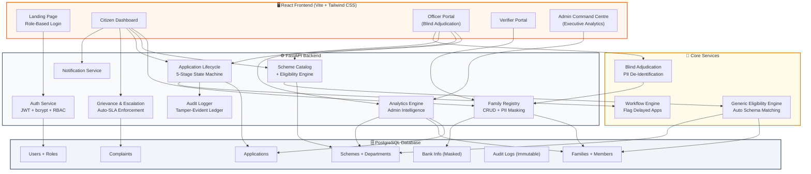
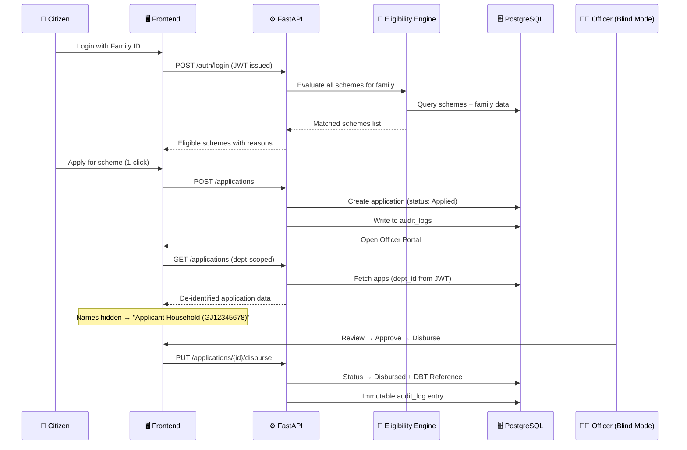

<p align="center">
  
  
  
  
  
</p>

# ParivarSetu (પરિવાર સેતુ)

### One Family – One ID: Unified Scheme Benefit Tracking & Direct Benefit Transfer Platform

**Government of Gujarat (ગુજરાત સરકાર) | General Administration Department**

---

ParivarSetu is a full-stack e-governance platform built for the **Government of Gujarat** under the **"One Family – One ID (GJ-XXXXXXXX)"** paradigm. It eliminates welfare benefit leakage, automates cross-department eligibility matching, enforces bias-free adjudication, and provides transparent, auditable Direct Benefit Transfer (DBT) disbursals — all through a single, unified Family ID.

> **Key Innovation:** ParivarSetu introduces **Blind Adjudication**, a **Generic Eligibility Engine** that auto-matches families to schemes across any department without manual paperwork, and **Executive Intelligence Analytics** for state administrators — features that go beyond traditional benefit management systems.

---

## 📐 System Architecture



### Data Flow: Citizen Application Lifecycle



---

## 🏛️ Role-Based Login Credentials

All demo personas use the password: **`Gujarat@2026`**

### 👤 Citizen — Smt. Priya Sharma
| Field | Value |
|---|---|
| **Email** | `priya.sharma@parivar.gujarat.gov.in` |
| **Password** | `Gujarat@2026` |
| **Family ID** | `GJ12345678` |
| **District** | Gandhinagar |
| **Category** | BPL, Income: ₹1,20,000 |

**What Citizen Can Do:**
- View family profile with verified members, income, health info, masked bank account
- Auto-discover eligible schemes via Eligibility Engine (zero paperwork)
- 1-click apply to any eligible scheme
- Track applications through 5-stage visual pipeline: `Applied → Under Review → Approved → Disbursed → Completed`
- File grievances with auto-escalation to officer inbox
- Receive real-time notifications for status changes

---

### 👨‍💼 Department Officers (3 Officers — Department Isolated)

| Officer | Department | Email | Password |
|---|---|---|---|
| **Dr. Rajesh Mehta** | Health & Family Welfare | `health.officer@gujarat.gov.in` | `Gujarat@2026` |
| **Shri Kirit Trivedi** | Education Department | `education.officer@gujarat.gov.in` | `Gujarat@2026` |
| **Smt. Hina Patel** | Industries & MSME | `msme.officer@gujarat.gov.in` | `Gujarat@2026` |

**What Officers Can Do:**
- View ONLY their department's schemes and applications (JWT-enforced isolation)
- **Blind Adjudication** — applicant names hidden, see only `Applicant Household (GJ12345678)`
- Review applications with "Inspect Facts" dossier (income, category, health — no names)
- Approve / Reject applications with mandatory remarks
- Execute DBT fund disbursals with auto-generated `DBT-GJ-XXXXX` reference
- View eligible families list (de-identified)
- Resolve citizen grievances
- Department-scoped analytics dashboard

---

### 🔍 Field Verifier — Shri Ramesh Joshi (Talati-cum-Mantri)

| Field | Value |
|---|---|
| **Email** | `talati.gandhinagar@gujarat.gov.in` |
| **Password** | `Gujarat@2026` |
| **Jurisdiction** | Gandhinagar |

**What Verifier Can Do:**
- Review provisional family registrations from field camps
- Approve / reject family registrations after field inspection
- Browse all enrolled (verified) families
- Toggle between "Pending Verification" and "Enrolled Families" tabs

---

### 🏢 State Administrator — Shri Rajesh Kumar, IAS

| Field | Value |
|---|---|
| **Email** | `admin@gujarat.gov.in` |
| **Password** | `Gujarat@2026` |

**What Admin Can Do (Read-Only Analytics — NO approve/reject):**
- **Executive Overview** — total families, total DBT disbursed, pending backlog, SLA breaches
- **Department-Wise Analysis** — per-department applications, amounts, approval rates
- **Proactive Gap Analysis** — families eligible but NOT yet applied (saturation gap)
- **District Saturation Map** — district-level registered families vs applications
- **Delayed Bottlenecks** — applications stuck > 3 days without officer action

---

## ⭐ Key Features

### 🧠 Generic Eligibility Engine (Auto Schema Matching)
Unlike hardcoded eligibility checks, ParivarSetu's engine **dynamically reads scheme rule columns** from the database and builds queries at runtime. Add a new scheme by inserting a database row — **zero code changes required**.

| Rule Column | Matches Against | Example |
|---|---|---|
| `max_income` | `Family.income` | ≤ ₹2,50,000 for BPL schemes |
| `category` | `Family.category` | `SC`, `ST`, `OBC`, `General` |
| `required_condition_tag` | `Family.health_tags[]` | `cardiac`, `diabetes`, `disability` |
| `required_class` | `EducationInfo.current_class` | `12th`, `Graduate` |
| `min_percentage` | `EducationInfo.last_percentage` | ≥ 60% for merit scholarships |
| `business_category` | `BusinessInfo.business_type` | `Manufacturing`, `Retail` |
| `min_business_age` | `BusinessInfo.business_age_months` | ≥ 12 months for MSME loans |

Uses PostgreSQL **GIN indexes on ARRAY columns** (`health_tags`, `education_tags`, `business_tags`) for O(1) eligibility matching even with 10,000+ families.

---

### 🛡️ Blind Adjudication (Anti-Bias De-Identification)
Officers **cannot see applicant names** — the backend strips all PII server-side:

| Real Data | What Officer Sees |
|---|---|
| `Smt. Priya Sharma` | `Applicant Household (GJ12345678)` |
| Family members by name | `Member #1 (Head)`, `Member #2 (Spouse)` |
| Bank account holder | `Beneficiary #GJ12345678` |
| Aadhaar number | `XXXX-XXXX-1234` (always masked) |

Prevents caste-based discrimination, religious bias, and favouritism. **DPDP Act 2023 compliant.**

---

### 🔐 Security Architecture

| Layer | Mechanism | Description |
|---|---|---|
| **Authentication** | JWT + bcrypt | Passwords hashed with bcrypt. Stateless JWT tokens with `role`, `dept_id`, `family_id` claims |
| **Authorization** | RBAC | 4 roles: `citizen`, `officer`, `verifier`, `admin` with dedicated FastAPI guards |
| **Dept Isolation** | JWT Claims | Officers access ONLY their department. `dept_id` extracted server-side, never from client |
| **Anti-IDOR** | Ownership Checks | Citizens cannot view/modify another family's data |
| **PII Masking** | `mask_identifier()` | Aadhaar: `XXXX-XXXX-1234`, Bank: `****4321` |
| **OWASP Headers** | HTTP Middleware | `X-Content-Type-Options`, `X-Frame-Options: DENY`, `X-XSS-Protection`, `Referrer-Policy` |
| **Audit Trail** | Immutable Ledger | Every action logged with `user_id`, `action`, `entity`, `timestamp` — cannot be deleted |

---

### 🔍 Transparency & Accountability

| Feature | How It Works |
|---|---|
| **5-Stage Pipeline** | Visual tracker: `Applied → Under Review → Approved → Disbursed → Completed` |
| **DBT Traceability** | Every disbursal generates immutable `DBT-GJ-XXXXX` reference in `audit_logs` |
| **Grievance Redressal** | Citizens file complaints at any stage, auto-escalation flags delayed cases |
| **SLA Enforcement** | Applications pending > 3 days auto-flagged as bottlenecks for admin |
| **Open API** | Full Swagger/OpenAPI docs at `/docs` |

---

### 📊 Executive Intelligence (Admin Analytics)

| Dashboard Tab | What It Shows |
|---|---|
| **Executive Overview** | Total families, total DBT disbursed, pending backlog, saturation gap, SLA breaches |
| **Dept Disbursals** | Per-department breakdown: applications count, amounts, approval rates |
| **Pending Applications** | Department-wise pending caseload |
| **Proactive Gap Analysis** | Per-scheme: eligible families vs applied (% coverage) |
| **District Saturation** | District-level families registered vs applications filed |

---

### 🗄️ Database Indexes for Fast Queries

| Table | Index / Constraint | Type | Purpose |
|---|---|---|---|
| `families` | `family_id` | **Primary Key** | O(1) lookup by Family ID |
| `families` | `ration_card_no` | **Unique** | Prevents duplicate ration cards |
| `families` | `health_tags`, `education_tags`, `business_tags` | **ARRAY + GIN** | O(1) eligibility matching |
| `users` | `email` | **Unique** | Fast login, no duplicate accounts |
| `applications` | `(family_id, member_id, scheme_id)` | **Unique Composite** | Prevents duplicate applications |
| `notifications` | `(family_id, scheme_id)` | **Unique Composite** | Prevents duplicate notifications |
| `bank_info` | `family_id` | **Unique FK** | One-to-one: one bank per family |
| `family_members`, `health_info`, `education_info`, `business_info` | `family_id` FK | **CASCADE** | Auto-cleanup on family deletion |

---

## 🚀 Quick Start Guide

### Prerequisites
- **Python 3.10+** (tested on Python 3.14)
- **Node.js 18+** & npm
- **PostgreSQL 14+** (default database: `parivarsetu` on port `5432`)

### 1. Database Setup
```bash
# Create database in PostgreSQL
CREATE DATABASE parivarsetu;

# Seed Gujarat dataset (74 families, 12+ schemes, 6 users, departments, audit logs)
cd backend
pip install -r requirements.txt
python scripts/init_db.py
```

### 2. Start Backend API
```bash
# Option A: Windows launcher
start-backend.bat

# Option B: Manual
cd backend
python -m uvicorn app.main:app --reload --port 8000
```
- API: `http://localhost:8000`
- Swagger Docs: `http://localhost:8000/docs`
- Health Check: `http://localhost:8000/health`

### 3. Start Frontend Portal
```bash
# Option A: Windows launcher
start-frontend.bat

# Option B: Manual
cd frontend
npm install
npm run dev
```
- Portal: `http://localhost:5173`

---

## 🧪 Automated Test Suite

```bash
cd backend
python -m pytest tests/ -v
```

**21 tests** across 4 test modules:

| Module | Coverage |
|---|---|
| `test_phase1.py` | Auth, JWT claims, role-based isolation, mock PDS registry |
| `test_phase2.py` | Scheme CRUD, eligibility engine, state machine transitions, DBT disbursals |
| `test_phase3.py` | Grievance lifecycle, auto-escalation, delayed applications, analytics |
| `test_phase5.py` | OWASP security headers, Aadhaar/Bank masking, anti-IDOR checks, verifier permissions |

---

## 💻 Tech Stack

| Layer | Technology |
|---|---|
| **Frontend** | React 19, Vite 8, Tailwind CSS, Lucide Icons, Recharts |
| **Backend** | FastAPI, SQLAlchemy ORM, Pydantic v2 (ConfigDict), Python 3.14 |
| **Database** | PostgreSQL 18 with GIN array indexing on health tags |
| **Authentication** | python-jose (JWT), bcrypt |
| **Design System** | Government of Gujarat NIC portal standard (`rounded-none`, sharp-edge, orange/amber/slate palette) |

---

## 📁 Project Structure

```
ParivarSetu/
├── backend/
│   ├── app/
│   │   ├── api/routes/
│   │   │   ├── auth.py           # Login, JWT issuance
│   │   │   ├── families.py       # Family CRUD + Blind Review
│   │   │   ├── schemes.py        # Scheme catalog + Eligibility
│   │   │   ├── applications.py   # 5-stage state machine + DBT
│   │   │   ├── complaints.py     # Grievance + Auto-escalation
│   │   │   ├── analytics.py      # Officer + Admin dashboards
│   │   │   └── notifications.py  # Real-time alerts
│   │   ├── core/
│   │   │   ├── config.py         # Environment settings
│   │   │   ├── database.py       # SQLAlchemy engine + session
│   │   │   └── security.py       # JWT, bcrypt, RBAC, PII masking
│   │   ├── models/
│   │   │   ├── user.py           # User + Role model
│   │   │   ├── family.py         # Family, Members, Health, Education, Business, Bank
│   │   │   ├── scheme.py         # Scheme + Department models
│   │   │   ├── application.py    # Application state machine
│   │   │   ├── complaint.py      # Grievance model
│   │   │   ├── notification.py   # Notification model
│   │   │   └── audit.py          # Immutable audit log
│   │   └── services/
│   │       ├── eligibility.py    # Generic Eligibility Engine
│   │       └── workflow.py       # Delayed application flagging
│   ├── scripts/init_db.py        # Seed 74 families, 12 schemes, 6 users
│   └── tests/                    # 21 automated tests
├── frontend/src/
│   ├── App.jsx                   # Main app + role routing
│   ├── components/layout/
│   │   ├── Header.jsx            # Persona switcher + logout
│   │   └── Sidebar.jsx           # Role-based navigation
│   ├── pages/
│   │   ├── LandingPage.jsx       # Role-based login portal
│   │   ├── CitizenDashboard.jsx  # Family profile + schemes + tracker
│   │   ├── OfficerPortal.jsx     # Blind review + DBT + analytics
│   │   ├── VerifierPortal.jsx    # Field verification desk
│   │   └── AdminPortal.jsx       # Executive Intelligence Centre
│   └── services/api.js           # Axios API client
├── start-backend.bat
├── start-frontend.bat
└── README.md
```

---

## 🔑 Key Differentiators

| Feature | Traditional Systems | ParivarSetu |
|---|---|---|
| Eligibility Check | Manual paperwork per scheme | **Auto Schema Matching** — engine reads rules from DB, zero code changes |
| Officer Bias | Officer sees full applicant identity | **Blind Adjudication** — names hidden, merit-only decisions |
| Cross-Department Access | Shared dashboards | **Cryptographic Dept Isolation** — JWT-enforced boundaries |
| Admin Oversight | Manual reports | **Real-time Executive Intelligence** with gap analysis |
| Benefit Tracking | Opaque status | **5-Stage Visual Pipeline** — citizen sees every transition |
| Accountability | Minimal logging | **Immutable Audit Ledger** — every action recorded with DBT reference |
| New Scheme Addition | Code changes + deployment | **Database row insert** — engine auto-discovers new schemes |
| Privacy | PII exposed to all roles | **PII Masking + Blind Review** — DPDP Act 2023 compliant |

---

<p align="center">
  <strong>🏛️ ParivarSetu — One Family, One ID, One Platform</strong><br/>
  <em>Government of Gujarat | General Administration Department</em><br/><br/>
  
  
  
</p>
